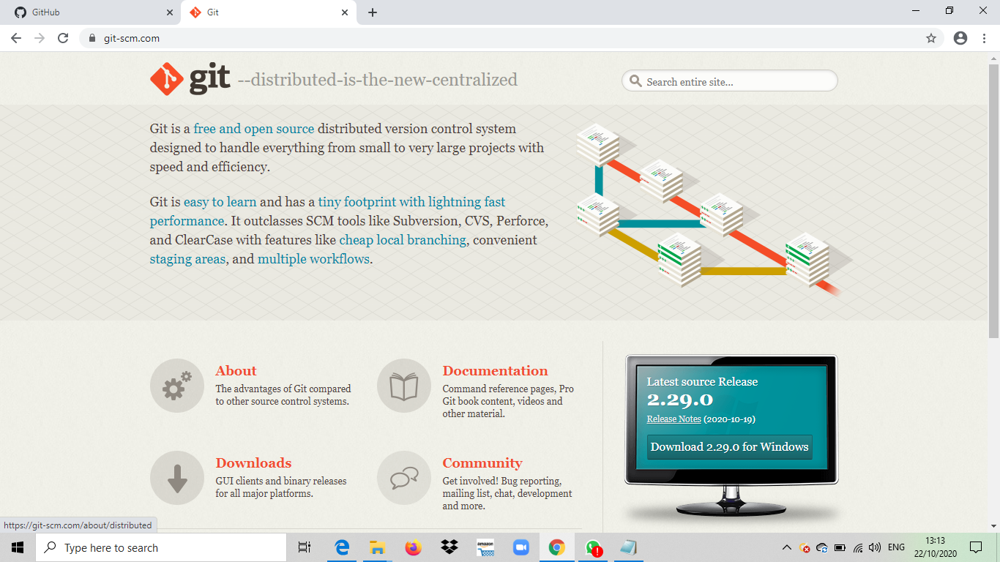

# PENGGUNAAN GIT

## Apa itu Git ?
* Git adalah salah satu sistem pengontrol versi(Version Control System) pada proyek perangkat lunak yang diciptakan Linus Torvalds.
* Pengontrol versi bertugas memcatat setiap perubahan pada file proyek yang dikerjakan oleh banyak orang maupun sendiri.
* Git dikenal juga dengan distributed revision control (VCS terdistribusi), artinya penyimpanan database Git tidak hanya berada dalam satu tempat saja.

# Instalasi Git
* Download **Git**, Buka website resminya Git [git-scm.com](https://git-scm.com).

  
* Kemudian unduh Git sesuai dengan arsitektur komputer kita. Kalau menggunakan 64bit, unduh yang 64bit. Begitu juga kalau menggunakan 32bit.
* Untuk pengguna linux ``sudo apt-get install git`` & untuk Mac ``brew install git``
* Selamat, Git sudah terinstal. Untuk mencobanya,silahkan buka **Terminal** atau **CMD**,kemudian ketik perintah

  ``git --version.``

  

# Menambahkan Global Config
* Pada saat pertama kali menggunakan git, perlu dilakukan konfigurasi
user.name dan user.email
* konfigurasi ini bisa dilakukan untuk global repostiry atau individual
repository.
* apabila belum dilakukan konfigurasi, akan mengakibatkan terjadi
kegagalan saat menjalankan perintah ```git commit```
* Config Global Repository

  ``$ git config --global user.name "nama_user"``

  ``$ git config --global user.email "nama_user"``

  

# Membuat Reposiory Local
* Buka direktory aktif, misal: 'c/Users/ADITYA BANI ISRO/tugasbani'
* Drop direktori ke terminal / CMD
* Buat direktory project praktikum pertama dengan nama tugasbani

  ``$ mkdir tugasbani``

  ``$ cd tugasbani``

  

* Sehingga terbentuk satu direktori baru dibawahnya, selanjutnya masuk kedalam direktori tersebut dengan perintah cd (change directory)
* direktory aktif menjadi: C:/Users/ADITYA BANI ISRO/tugasbani/.
* Jalankan perintah git init, untuk membuat repository local.
``$ git init``


* Repository baru berhasil di inisialisasi, dengan terbentuknya satu direktori hidden dengan nama .git
* Pada direktori tersebut, semua perubahan pada working directory akan disimpan.

# Menambahkan File baru pada repository
* Untuk membuat file dapat menggunakan text editor, lalu menyimpan filenya pada direktori aktif (repository)
* disini kita akan coba buat satu file bernama README.md (text file)

  ``$ echo “file pertama” >> README.md``

  

* File README.md berhasil dibuat.

  

# Menambahkan File baru pada repository
* Untuk menambahkan file yang baru saja dibuat tersebut gunakan perintah git add.

  ``$ git add README.md``

* File README.md berhasil ditambahkan.
* Untuk mengecek nya gunakan perintah

  ``$ git status``


  

# Commit (Menyimpan perubahan ke database)
* Untuk menyimpan perubahan yang ada kedalam database repository local, gunakan perintah

  ``$ git commit -m 'Commit pertama'``
* Untuk mengeceknya menggunakan Perintah

  ``$ git status``

* Perubahan berhasil disimpan.

   

# Membuat repository server
* Server reopsitory yang akan kita gunakan adalah http://github.com, Anda harus membuat akun terlebih dahulu.
* Pada laman github, klik tombol start a project, atau
* Dari menu (icon +) klik New Repository

  

# Membuat repository server
* Isi nama repository nya, misal: Latihan Bani
* lalu klik tombol Create repository

  

# Menambahkan Remote Repository
* Remote Repository merupakan repository server yang akan digunakan untuk menyimpan setiap perubahan pada local repository, sehingga dapat diakses oleh banyak user.
* Untuk menambahkan remote repository server, gunakan perintah git remote add origin [url]

  ``$ git remote add origin https://github.com/Aditya-Bani/Latihan-Bani.git``


# Push (Mengirim perubahan ke server)
* Untuk mengirim perubahan pada local repository ke server gunakan perintah git push.

  ``$ git push -u origin master``

* Perintah ini akan meminta memasukkan username dan password pada akun github.com

  

# Lihat hasilnya pada server repository
* Buka laman github.com, arahkan pada repositori- nya.
* Maka perubahan akan terlihat pada laman tersebut.

  

# Clone Repository
* Clone repository, pada dasarnya adalah meng-copy repository server dan secara otomatis membuat satu direktory sesuai dengan nama repositorynya (working directory).
* Untuk melakukan cloning, gunakan perintah git clone [url]

  ``$ git clone https://github.com/Aditya-Bani/Latihan-Bani.git``

  
